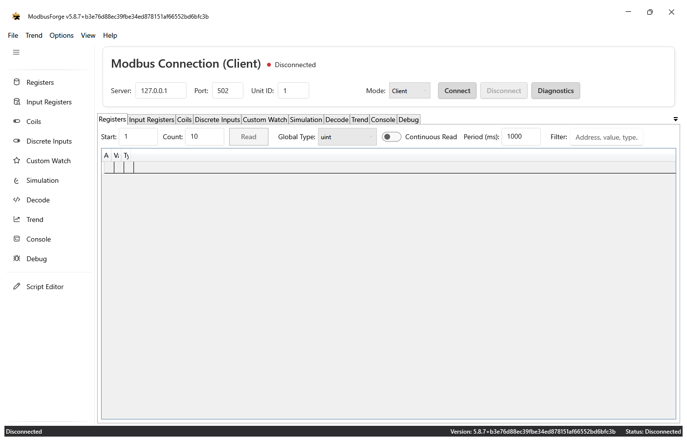
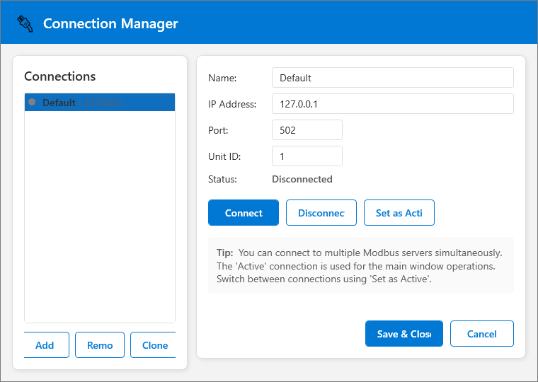
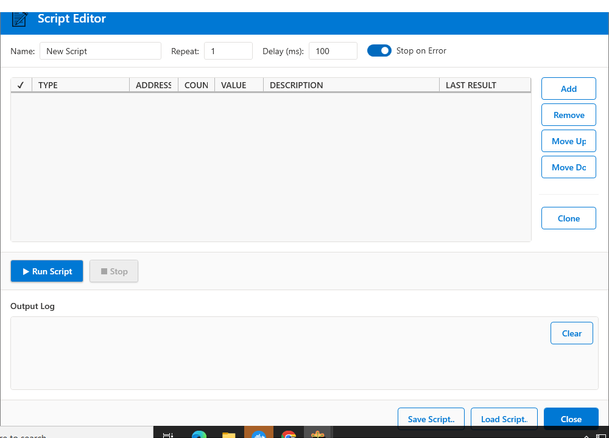
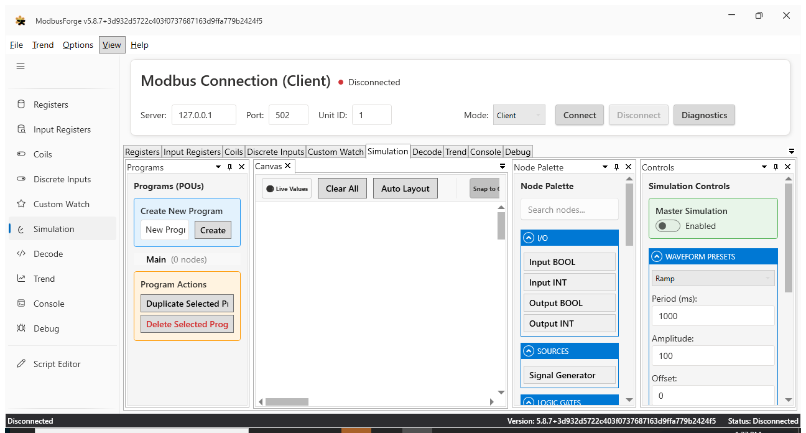
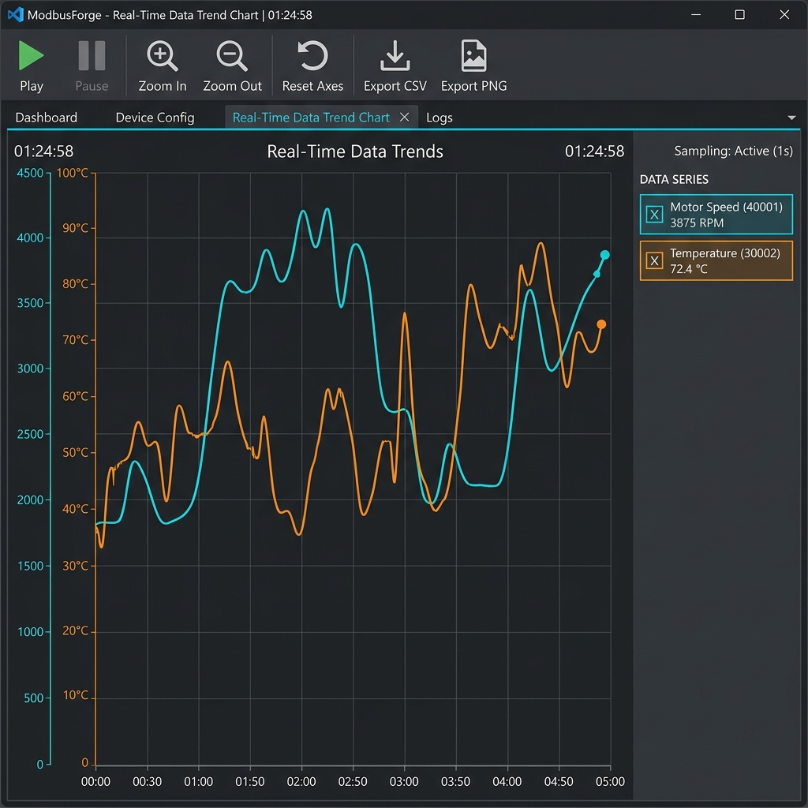

# ModbusForge v6.0.4

[](https://dotnet.microsoft.com/)
[](https://www.microsoft.com/windows)
[](LICENSE)
[](https://github.com/nokkies/ModbusForge/releases)
[](https://github.com/nokkies/ModbusForge/issues)

A professional Modbus TCP/RTU/ASCII client/server application built with .NET 8.0 and WPF. ModbusForge provides comprehensive tools for testing, monitoring, and automating Modbus communications.


## Table of Contents

- [Quick Start](#quick-start)
- [What's New](#whats-new)
- [Key Features](#key-features)
- [Screenshots](#screenshots)
- [Installation](#installation)
- [Feature Details](#feature-details)
- [Modes: Client vs Server](#modes-client-vs-server)
- [FAQ](#faq)
- [Contributing](#contributing)
- [Build and Release](#build-and-release)
- [Versioning](#versioning)
- [Support](#support)

---

## Quick Start

Get up and running with ModbusForge in 5 minutes.

### 1. Launch the Application

```powershell
dotnet run --project ModbusForge
```

### 2. Configure Mode

Choose between **Client** or **Server** mode in `appsettings.json`:

```json
{
  "ServerSettings": {
    "Mode": "Client",
    "DefaultPort": 502,
    "DefaultUnitId": 1
  }
}
```

### 3. Connect (Client Mode)

1. Enter the IP address of your Modbus TCP server
2. Enter the port (default: 502)
3. Enter the Unit ID (slave ID)
4. For **RTU/ASCII** connections, click the gear icon and set the COM port, baud rate, data/stop bits, parity, and RTS (RS-485)
5. Click **Connect**

### 4. Read Data

1. Select the **Registers** tab
2. Enter the starting address and count
3. Click **Read**
4. Enable **Continuous Read** for automatic polling

### 5. Explore More

- **Options → Connection Manager**: Save and manage multiple connection profiles
- **Options → Device Scanner**: Discover Modbus TCP devices on your network
- **Options → Script Editor**: Create automated test sequences
- **Options → Preferences**: Customize application behavior
- **Help → Keyboard Shortcuts**: View all available shortcuts

---

## What's New

### v6.0.4 - Current Release

- **Fixed startup crash (wpfgfx_cor3.dll EntryPointNotFoundException)**: Removed WPF native runtime DLLs from the installer. These DLLs are part of the shared `Microsoft.WindowsDesktop.App` runtime; shipping them with the app caused a mismatch when the installed .NET runtime was patched to a newer version, leading to a startup `XamlParseException`.

### v6.0.3

- **Custom Watch separate write value**: Added a new `Write Value` column. `Value` is now read-only and shows the live read value; `Write Value` is used for one-shot writes and continuous writes. This lets trends/global monitoring keep reading while you write a different value.

### v6.0.2

- **Visual Node Editor (ADD/COMPARE constant)**: `Const` / `Val` values are now used when `Input2` is not connected. Previously the unconnected `Input2` was treated as a default coil address and read as 0.
- **One-click auto-update**: When an update is found, you can now choose to **download and install** it automatically. The installer runs silently, closes the current application, replaces the files, and relaunches ModbusForge.

### v6.0.0

- **Update checking**: New **Help → Check for Updates…** menu item and optional **Check for updates on startup** preference. ModbusForge compares the running version against the latest GitHub release.
- **Script Editor**: Selection theming now uses the fluent DataGrid style so selected rows remain readable.
- **Visual Node Editor (ADD block)**: Constant input (`CompareValue`) is now used when `Input2` is not connected.
- **Trends tab**: Trend view correctly resolves its view model when loaded, so custom tags with trending enabled render again.
- **Visual Node Editor (POU switching)**: Switching between programs (POUs) now saves the current nodes and wiring before loading another program, so wiring is no longer lost.

### v5.9.0

- **Serial Modbus (RTU + ASCII)**: Added COM-port selection, baud/parity/data/stop bits, and RS-485 RTS toggle through the Connection Manager

### v5.8.7

- Updated README screenshots to reflect the current ModbusForge UI

### v5.6.0 - Documentation & User Experience

- **Comprehensive Help System**: New searchable help window with F1 support
- **Troubleshooting Tools**: Built-in troubleshooting guide with diagnostic export
- **Improved Keyboard Shortcuts**: Expanded shortcut coverage with quick reference printing
- **Modern Dialog Styling**: About, Keyboard Shortcuts, Script Editor, and Troubleshooting windows now use Fluent UI
- **Tab Stability**: Removed accidental tab close buttons to prevent empty panes
- **Better README**: Restructured documentation with quick start, FAQ, and contributing sections

### v5.3.0 - UX Quick Wins

- **Automatic Continuous Read**: Trend lines now automatically enable continuous read when added
- **Enhanced Error Logging**: Specific exception handling with detailed logging
- **Global Keyboard Shortcuts**: Ctrl+R read, Ctrl+T trends, Ctrl+S save, F5 refresh, F1 help
- **Improved Error Messages**: User-friendly messages with recovery suggestions

### v5.2.0 - Resilience & Error Handling

- **Centralized Resilience**: Retry policy with exponential backoff and jitter
- **Circuit Breaker Pattern**: Prevents cascading connection failures
- **Startup Configuration Validation**: Schema validation for `appsettings.json`
- **Validation Service**: Input validation for IP addresses, ports, unit IDs, and registers

See [FEATURE_ROADMAP.md](FEATURE_ROADMAP.md) for the full development roadmap.

---

## Key Features

### Core Functionality
- 🔌 **Client & Server Modes**: Switch between Modbus TCP client and server
- 🔗 **Multiple Transports**: Connect over **TCP**, **RTU**, or **ASCII** serial
- 📝 **Full Register Support**: Read/write holding registers, input registers, coils, and discrete inputs
- 📊 **Real-time Monitoring**: Continuous polling with configurable intervals
- 🔍 **Connection Diagnostics**: Test TCP/serial and Modbus connectivity with latency measurements
- 🧩 **Advanced Function Codes**: FC22 Mask Write Register, FC23 Read/Write Multiple Registers, FC43 Read Device Identification (client and server)

### Device Discovery
- 🛰️ **Device Scanner**: Sweep an IP range, a port range and unit IDs 1–247
- FC43 device identification reports vendor, product code and revision
- Function-code detection lists which of FC01-FC04 each unit implements
- Optional register-range probe on each discovered unit
- Save discovered devices straight into connection profiles, or export the scan as CSV

### Multi-Device Support
- Connect to multiple Modbus servers simultaneously
- Save and manage connection profiles
- Quick switching between active connections
- Profiles persist between sessions

### Scripting & Automation
- Visual script editor for creating test sequences
- Support for read/write operations, delays, and logging
- Run scripts with repeat counts and configurable delays
- Save/load scripts as `.mbscript` files

### Data Visualization
- 📈 **Trend Charts**: Real-time graphing with zoom/pan controls
- 📤 **CSV/PNG Export**: Export trend data and charts
- 🖥️ **Console Logging**: Real-time log of all Modbus operations

### Custom Data Tab
- Per-row configuration: Area, Type (uint/int/real/string)
- On-demand and continuous read/write
- Live value updates with trend integration
- Save/Load configurations to JSON

### Visual Simulation
- 🎨 **Visual Node Editor**: Graphical programming for Modbus simulations
- 📶 **Signal Generators**: Ramp, Sine, Triangle, and Square waveforms
- 🔗 **Node Connections**: Wire nodes together to define data flow
- 🔄 **Real-time Simulation**: Execute simulations and monitor values

---

## Screenshots

### Main Interface

*The main window provides a tabbed interface for registers, coils, custom data, simulation, trends, and console logging.*

### Connection Manager

*Save and manage multiple Modbus connection profiles with quick connect/disconnect capabilities.*

### Script Editor

*Create and run automated test sequences with a visual command editor.*

### Visual Node Editor

*The Simulation tab provides a visual node editor with a node palette and simulation controls for building signal-generation and Modbus-output simulations.*

### Trend Charts

*Monitor register values over time with real-time graphing, zoom, pan, and export capabilities.*

---

## Installation

When you download and run the installer for ModbusForge, Windows Defender SmartScreen will likely show a warning because the application is not digitally signed with a commercial certificate.

To install the application, follow these steps:

1. Run the `ModbusForge-x.x.x-setup.exe` installer.
2. Windows will show a blue window titled "Windows protected your PC".
3. Click on the **More info** link.
4. The publisher will be listed as "Unknown". Click the **Run anyway** button to proceed with the installation.

---

## Feature Details

### Connection Manager

Access via **Options → Connection Manager**

- Create, edit, and delete connection profiles
- Choose transport: **TCP**, **RTU**, or **ASCII**
- TCP profiles store: Name, IP Address, Port, Unit ID
- Serial profiles store: Name, COM Port, Baud Rate, Data Bits, Parity, Stop Bits, RTS, Unit ID
- Connect/disconnect individual profiles
- Set active connection for main window operations
- Profiles saved to `%AppData%\ModbusForge\connection-profiles.json`

### Serial Configuration

When creating an **RTU** or **ASCII** connection:

1. Select **RTU** or **ASCII** from the **Transport** dropdown
2. Enter the **COM Port** your device is attached to (e.g. `COM3`)
3. Set the **Baud Rate** (commonly `9600` or `115200`)
4. Set the **Data Bits** (`7` or `8`)
5. Set the **Parity** (`None`, `Even`, `Odd`, `Mark`, or `Space`)
6. Set the **Stop Bits** (`One`, `OnePointFive`, or `Two`)
7. Enable **RTS** if your RS-485 adapter requires Request-to-Send toggle
8. Enter the **Unit ID** and click **Connect**

Serial profiles use the same read/write register and coil operations as TCP profiles, with 1-based addresses converted to the 0-based Modbus protocol addresses automatically.

### Device Scanner

Access via **Options → Device Scanner...**

Scans an inclusive IPv4 range (up to 4096 addresses) across a port range (up to 64 ports)
and any subset of unit IDs 1–247, using a short-lived connection per endpoint so live
polling is never disturbed.

**Scan settings**
- Start/End IP, Port from/to, Unit ID from/to
- Register type and probe address used for detection
- Connect and response timeouts, and the number of endpoints probed in parallel
- **Read device identification (FC43)** for vendor, product code and revision
- **Detect function codes (FC01-FC04)** reads one item from each register space to work out
  which read functions a unit implements; a unit that answers *illegal data address* still
  counts as implementing the function, only *illegal function* excludes it
- **Scan register range** to list which addresses of a discovered unit are readable

**Results**
- Status per unit: `Responded`, `RespondedWithException` (device present but the address is
  unsupported), `NoModbusResponse` (port open, unit silent) or `NoTcpConnection`
- **Add to Profiles** stores the selected device in `connection-profiles.json`
- **Function codes** column shows the detected read functions, e.g. `FC03, FC04`
- **Export CSV** writes one row per device plus one row per scanned register
- Scans report progress and can be stopped at any time; results found so far are kept

### Script Editor

Access via **Options → Script Editor** or press **Ctrl+E**

**Supported Commands:**
- Read Holding Registers / Input Registers
- Read Coils / Discrete Inputs
- Write Single Register / Coil
- Delay (configurable milliseconds)
- Log messages

**Script Settings:**
- Repeat count for looping
- Delay between commands
- Stop on error option

**Output Log:** Real-time execution feedback

See [docs/SCRIPTING_GUIDE.md](docs/SCRIPTING_GUIDE.md) for detailed scripting documentation.

### Preferences

Access via **Options → Preferences**

- Auto-reconnect on connection loss
- Show diagnostics on connection error
- Console logging settings
- Confirm before exit
- Check for updates on startup
- Settings saved to `%AppData%\ModbusForge\settings.json`

### Check for Updates

Access via **Help → Check for Updates…**

ModbusForge checks the latest GitHub release against the running version.
- **Manual check**: open the menu item at any time.
- **Automatic check**: enable `Check for updates on startup` in Preferences.
- When a newer version is found, choose **Yes** to download and install it automatically, **No** to open the release page in your browser, or **Cancel** to close the dialog.
- The installer is downloaded to your temp folder, runs silently, closes the running application, installs the update, and relaunches ModbusForge.
- If the app is already on the latest release or the check cannot reach GitHub, a brief message is shown.

### Custom Data Tab

- **Area Types:** HoldingRegister, Coil, InputRegister, DiscreteInput
- **Data Types:** uint, int, real (32-bit float), string
- On-demand Read/Write buttons per row
- Continuous Write mode per row
- Live reads when Global Continuous Read is enabled
- Save/Load configurations to JSON

### Register Templates (CSV / Excel Import)

Import a vendor register map from the **Tag Browser → Import Template** button. The preview
dialog shows every parsed row, highlights rejected rows in red and warning rows in amber, and
only imports the rows that validated. **CSV Template** writes an example file to fill in.

Supported columns (header names are matched case-insensitively, ignoring spaces, `_` and `-`;
common vendor synonyms such as `Tag`, `Register`, `Register Type`, `Comment`, `EU` are accepted):

| Column | Meaning |
| --- | --- |
| `TagName` *(required)* | Tag name |
| `Address` *(required)* | Register address, interpreted using the selected addressing convention |
| `Description`, `Group` | Description and tag group |
| `RegisterType` | `Holding` / `Input` / `Coil` / `Discrete` (also `HR`, `IR`, `4x`, `3x`, `0x`, `1x`) |
| `Bit` | Bit index 0–15 within a packed status word |
| `DataType` | `Bool`, `Int16`, `UInt16`, `Int32`, `UInt32`, `Float`/`Real`, `Double`, `String` |
| `WordOrder` | `BigEndian`/`ABCD` or `LittleEndian`/`CDAB` (word-swapped) |
| `Length` | Registers occupied; defaults to the data type width |
| `Scale`, `Offset`, `Unit` | Engineering-unit conversion applied to polled and written values |
| `Access` | `r` / `ro` (read-only) or `rw` |
| `Enum` | `0=Off;1=On` — displayed instead of the raw value |
| `Default` | Default value |
| `Range` | `0..100` (or separate `Min`/`Max` columns) — used as the alarm limits |

Addressing conventions: **0-based** (protocol address), **1-based** (address − 1) and
**Modicon** (`40001` → holding register 0, `30001` → input register 0, `10001` → discrete
input 0, `000001` → coil 0; 6-digit forms are also supported).

Example:

```csv
TagName,Description,Group,RegisterType,Address,Bit,DataType,WordOrder,Length,Scale,Offset,Unit,Access,Enum,Default,Range
VFD_OutputFreq,Output frequency,VFD,Holding,40001,,UInt16,BigEndian,1,0.01,0,Hz,r,,,0..60
VFD_Current,Motor current,VFD,Holding,40002,,Float,CDAB,2,0.1,0,A,r,,,0..120
VFD_Command,Command word,VFD,Holding,40010,,UInt16,BigEndian,1,1,0,,rw,0=Stop;1=Run;2=Jog,0,
VFD_FaultBit,Fault bit of status word,VFD,Holding,40011,5,Bool,BigEndian,1,1,0,,r,0=Ok;1=Fault,,
```

Imported templates are stored as JSON in `%AppData%\ModbusForge\templates\` so they can be
reused, edited or shared. Excel (`.xlsx`) files are read from the first worksheet.

### Advanced Functions

Open **Options → Advanced Functions...** to use the protocol functions that go beyond the
standard read/write set. All addresses are 1-based, exactly like the rest of the UI.

| Function | What it does | Inputs |
|----------|--------------|--------|
| **FC22 - Mask Write Register** | Atomically sets/clears bits of one holding register: `result = (current AND andMask) OR (orMask AND NOT andMask)` | Address, AND mask, OR mask |
| **FC23 - Read/Write Multiple Registers** | Writes a block of registers and reads a (possibly different) block in a single transaction; the write happens first | Read address/count, write address, comma-separated values (`0x` prefix for hex) |
| **FC43 / MEI 14 - Read Device Identification** | Queries the device identity strings (vendor, product code, revision, vendor URL, product name, model, application) | Category: Basic, Regular or Extended |

The result of each call, or the Modbus exception returned by the device, is shown in the
status bar at the bottom of the dialog; FC43 objects are listed in a grid.

In **server mode** ModbusForge answers all three functions as well. The identity served by
FC43 defaults to the ModbusForge vendor/product strings and the running application version.

The same operations are available programmatically through `IModbusService`:

```csharp
ushort? result = await modbusService.MaskWriteRegisterAsync(unitId: 1, registerAddress: 5, andMask: 0x00F2, orMask: 0x0025);
ushort[]? read  = await modbusService.ReadWriteMultipleRegistersAsync(1, readStartAddress: 1, readCount: 4, writeStartAddress: 10, writeValues: new ushort[] { 1, 2 });
DeviceIdentification? id = await modbusService.ReadDeviceIdentificationAsync(1, DeviceIdObject.VendorName, DeviceIdCategory.Basic);
```
### Trend & Logging

- Real-time trend charts with zoom/pan
- Adjustable retention window (1–60 minutes)
- Export to CSV or PNG
- Console tab shows all Modbus operations

### Visual Node Editor

Access via the **Simulation** tab or left navigation panel.

- Drag nodes from the palette onto the canvas
- Connect nodes by dragging from outputs to inputs
- Configure node parameters in the properties panel
- Run simulations and monitor real-time values

---

## Modes: Client vs Server

Configure in `ModbusForge/ModbusForge/appsettings.json` under `ServerSettings`:

- `Mode`: `Client` or `Server`
- `DefaultPort`, `DefaultUnitId`, etc.

Both client and server services are registered; the `MainViewModel` selects the `IModbusService` implementation at runtime based on `Mode`.

### Client Mode
Connect to an existing Modbus TCP server. Use this for testing and monitoring real devices.

### Server Mode
Act as a Modbus TCP server for testing client applications. Configure the listening port and allowed Unit IDs.

---

## FAQ

### Q: What operating systems are supported?
**A:** ModbusForge is built for Windows 10 and Windows 11 using WPF and .NET 8.0.

### Q: Do I need administrator privileges?
**A:** Only if you use the default Modbus port 502. Windows requires admin privileges to bind to ports below 1024. You can use a higher port number (e.g., 1502) to avoid this.

### Q: Can I connect to multiple devices at once?
**A:** Yes, use the Connection Manager to create and manage multiple profiles. You can switch between active connections.

### Q: Where are my settings saved?
**A:** Application settings are saved to `%AppData%\ModbusForge\settings.json`. Connection profiles are saved to `%AppData%\ModbusForge\connection-profiles.json`.

### Q: How do I export trend data?
**A:** Open the Trend tab and use the **Trend** menu to export to CSV or PNG.

### Q: What file format does the Script Editor use?
**A:** Scripts are saved as `.mbscript` files in JSON format.

### Q: The application won't connect to my device. What should I check?
**A:** Verify the IP address, port, and Unit ID. Ensure the device is reachable on the network and that your firewall allows the connection. Use the **Connection Manager** diagnostics or **Help → Troubleshooting** for more guidance.

### Q: Is ModbusForge open source?
**A:** Yes, ModbusForge is open source. See the [LICENSE](LICENSE) file for details.

---

## Contributing

We welcome contributions to ModbusForge! Here are some ways you can help:

### Reporting Issues
- Check existing issues first to avoid duplicates
- Provide detailed steps to reproduce the problem
- Include your ModbusForge version, Windows version, and .NET version
- Attach screenshots or logs if applicable

### Suggesting Features
- Open a GitHub issue with the `enhancement` label
- Describe the feature and its use case
- Include mockups or examples if possible

### Code Contributions
1. Fork the repository
2. Create a feature branch: `git checkout -b feature/your-feature-name`
3. Make your changes following the existing code style
4. Add tests if applicable
5. Commit with clear messages
6. Push to your fork and open a Pull Request

### Code Style
- Use `ILogger` for all logging (no `Debug.WriteLine` or custom file logging)
- Use constants for magic numbers
- Implement proper event handler cleanup to prevent memory leaks
- Add input validation with visual feedback for user inputs

---

## Build and Release

Below are PowerShell commands tested on Windows to produce a Release build and package artifacts.

### Prerequisites

- [.NET 8.0 SDK](https://dotnet.microsoft.com/download/dotnet/8.0)
- Visual Studio 2022 (17.0 or later) with .NET desktop development workload (optional)

### Build (Release)

```powershell
dotnet clean
dotnet restore
dotnet build ModbusForge.sln -c Release
```

### Publish (framework-dependent, single-file)

```powershell
$version = "5.8.7"
dotnet publish .\ModbusForge\ModbusForge.csproj -c Release -r win-x64 --self-contained false -p:PublishSingleFile=true -p:PublishTrimmed=false -o .\publish\win-x64
```

### Publish (self-contained, single-file)

```powershell
$version = "5.8.7"
dotnet publish .\ModbusForge\ModbusForge.csproj -c Release -r win-x64 --self-contained true -p:PublishSingleFile=true -p:IncludeNativeLibrariesForSelfExtract=true -p:PublishTrimmed=false -o .\publish\win-x64-sc
```

### Create a ZIP Artifact

```powershell
$version = "5.8.7"
Compress-Archive -Path .\publish\win-x64\* -DestinationPath .\ModbusForge-$version-win-x64.zip -Force
# or for self-contained
Compress-Archive -Path .\publish\win-x64-sc\* -DestinationPath .\ModbusForge-$version-win-x64-sc.zip -Force
```

### Create an Installer

```powershell
& "C:\Program Files (x86)\Inno Setup 6\ISCC.exe" "setup\ModbusForge.iss"
```

---

## Versioning

- The window title displays the application version from the assembly ProductVersion
- Versions follow [Semantic Versioning](https://semver.org/)
- See [FEATURE_ROADMAP.md](FEATURE_ROADMAP.md) for planned releases

---

## Support

- **GitHub Issues**: [https://github.com/nokkies/ModbusForge/issues](https://github.com/nokkies/ModbusForge/issues)
- **Email**: [reinach@softwareForge.cc](mailto:reinach@softwareForge.cc)
- **Documentation**: See the `docs/` folder and in-app Help (F1)

---

*Built by Reinach van Nieuwenhuizen*
